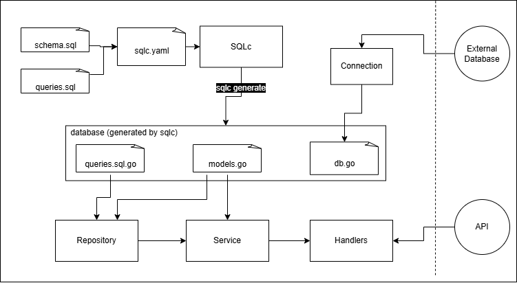

# SQLC API Go

This project leverages the **Echo** framework and **SQLC** to build a Go API integrated with a PostgreSQL database.

## Versioning Table

| Date       |        Version      |                           Description                           |     Commit    | 
|------------|---------------------|-----------------------------------------------------------------|---------------|
| 2024-12-05 | 0.1.3 :zap:         | Refactor README and comments for better readability and clarity |   `xxxxxxx`   |  
| 2024-12-05 | 0.1.2 :wastebasket: |                           Clean code                            |   `4bbc3e9`   | 
| 2024-12-05 | 0.1.1 :sparkles:    |        Added cpf validation + GetAllUsers + GetuserAge          |   `d6aafd1`   | 
| 2024-12-04 | 0.1.0 :tada:        | Initial project setup with basic structure and dependencies.    |   `5bca6da`   | 

## Table of Contents
1. [Project Estructure](#project-structure)
2. [Main Workflow](#main-workflow)
3. [Setup Instructions](#setup-instructions)
4. [Installation from scratch](#installation-from-scratch)
5. [API Documentation](#api-documentation)
6. [References](#references)
---

## Project Structure




```plaintext
sqlc-api-go/
├── doc/                    # Documentations and diagrams
├── cmd/main.go             # Application entry point, initializes and starts the server
├── internal/user/          # Business logic and data access layer for user-related operations
│   ├── handler.go          # Handles HTTP requests and responses for user routes
│   ├── service.go          # Contains business rules and logic for user operations
│   └── repository.go       # Implements data access methods for user-related queries
├── database/               # Database interaction and generated code
│   ├── models.go           # Structs representing database entities
│   └── query.sql.go        # Auto-generated code by SQLC for database queries
├── config/
│   └── database.go         # Configuration for connecting to the database
├── .env                    # Environment variables for sensitive data (e.g., credentials, ports)
├── query.sql               # SQL queries used by SQLC to generate Go code
├── schema.sql              # SQL script defining the database schema
├── go.mod                  # Declares dependencies and module information for the project
└── go.sum                  # Dependency lock file, ensuring version consistency

```

---

## Main Workflow
1. **Connect to the database (Pool):** Initialize the DB pool using `config.InitDB`.
2. **Create Queries instance:** Use the pool to generate `Queries` for database operations.
3. **Setup layers:**
   - Build **Repository** with `Queries`.
   - Build **Service** with Repository.
   - Build **Handler** with Service.
4. **Initialize Echo and endpoints:** Create an Echo instance, define routes, and start the server on port `8080`.

---
## Setup instructions 

Clone the Repository
Clone the project to your local machine:

```bash
git clone https://github.com/MaluMSiza/sqlc-api-go.git
cd sqlc-api-go
```

Install Dependencies
Make sure you have Go installed, then download the required dependencies:

```bash
go mod tidy
```
Set Up Environment Variables
Create a .env file in the root directory with the following variables:

```env
DB_USER=xxxxx
DB_PASSWORD=xxxxx
DB_HOST=xxxxx
DB_PORT=xxxxx
DB_NAME=xxxxx
```
Replace `xxxxx` with your PostgreSQL credentials.

Create your queries
Create you `schema.sql` and `query.sql` and generate your queries:
```bash
sqlc generate
```
Run the Server:
```bash
go run ./cmd/main.go
```

## Installation from scratch

1. **Set Up Go Environment**:
   - Install Go and ensure `GOPATH` and `GOROOT` variables are properly configured.

2. **Initialize the Project**:
   ```bash
   mkdir -p $GOPATH/src/github.com/MaluMSiza/sqlc-api-go
   cd $GOPATH/src/github.com/MaluMSiza/sqlc-api-go
   code .
   go mod init github.com/MaluMSiza/sqlc-api-go
   ```

3. **Install Dependencies**:
   ```bash
   go get -u github.com/labstack/echo/v4
   go install github.com/sqlc-dev/sqlc/cmd/sqlc@latest
   go get github.com/jackc/pgx/v5/pgxpool
   go get github.com/joho/godotenv
   ```

4. **Prepare the Database**:
   - Use `schema.sql` to create the database schema, configure `sqlc.yaml`.
   - Configure the connection settings in the `.env` file.
   - Use sqlc generate to create de `database` module
   ```bash
   sqlc generate
   ```

5. **Run the Server**:
   ```bash
   go run ./cmd/main.go
   ```

---

### API Documentation
---

You can easily interact with the API using **Postman**. To do this, follow the steps below to import the API documentation directly from this repository:

   #### 1. Access the JSON Documentation

   The API documentation is available in **JSON** format in this repository. You can view the file by clicking the link below:

   - [API Documentation (JSON)](docs/api-documentation.json)

   #### 2. Import the Documentation into Postman

   To import the documentation into **Postman**, follow these steps:

   - Open **Postman** and click on **"Import"** in the top left corner.
   - Select **"Upload Files"** and choose the `api-documentation.json` file from the `doc` folder in this repository.
---


## References 

- **[Echo](https://echo.labstack.com/docs):** Web framework for routing and middleware management.
- **[SQLC](https://docs.sqlc.dev/en/latest/overview/install.html):** Generates Go code from SQL files, ensuring strongly typed queries.
- **[Clean architeture](https://github.com/bxcodec/go-clean-arch/tree/master):** Go Clean Architecture